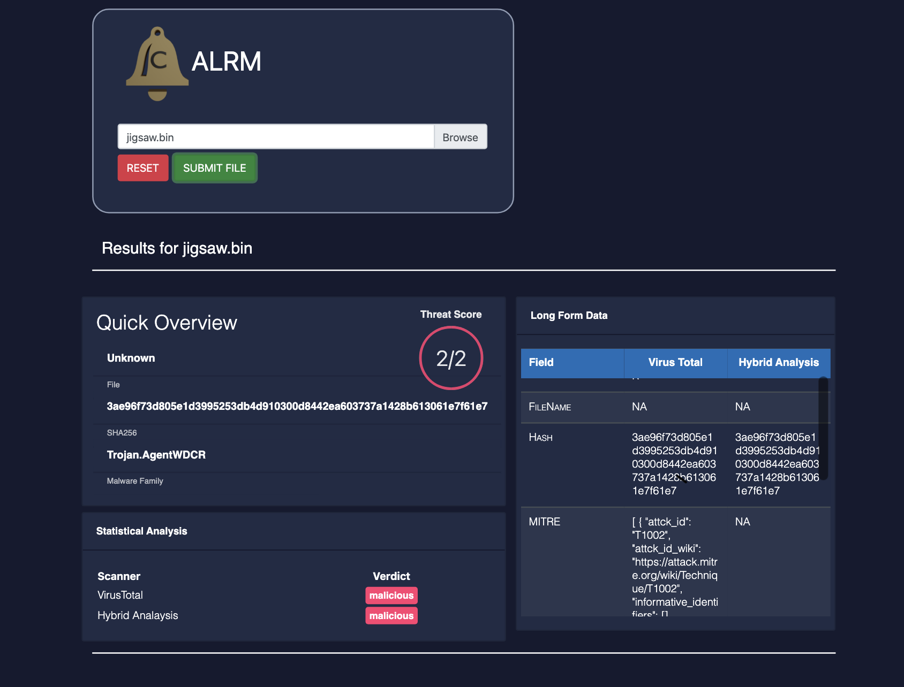

# C-ALRM

---





C ALRM (developed by **C**handni Sindhav, **A**shley Barkworth, **L**ucas McDonald, **R**ehnuma Tabassum, and **M**ike Simister) is a web application that lets users submit suspicious files and then analyzes them leveraging several online sandboxing services. The aggregated results are produced for the user in a single report. 

This app was created during the [GeekPeek 2021 hackathon](https://cyber.gc.ca/en/events/geekpeek-1) from Dec 13-17 put on by the Canadian Centre for Cyber Security.
 
The application is built with Bootstrap/Vue.js on the frontend and Flask/Python on the backend. The design is based on tutorial [here](https://testdriven.io/blog/developing-a-single-page-app-with-flask-and-vuejs/)

#### Instructions

To use the malware service APIs, obtain API keys from 
   + [Hybrid Analysis](https://www.hybrid-analysis.com/docs/api/v2)
   + [VirusTotal](https://developers.virustotal.com)


Then add them under the corresponding sections in the `config.ini` file.
 
Run the server-side Flask app in one terminal window:
```
$ cd flask-vue-app/server
$ python3.9 -m venv env
$ source env/bin/activate
(env)$ pip install -r requirements.txt
(env)$ python3 app.py
```
Go to http://localhost:5000/malware to look at the JSON output from the report

Run the client-side Vue app in a second terminal window:
```
$ cd flask-vue-app/client
$ npm install
$ npm run serve
``` 
Go to http://localhost:8080

In case you run into package errors, the npm packages can be installed with the following:
```
$ npm install -g @vue/cli@4.5.11
$ npm install axios@0.21.1 --save
$ npm install bootstrap@4.6.0 --save
$ npm install bootstrap-vue@2.21.2 --save
$ npm install vue-css-donut-chart --save
```

